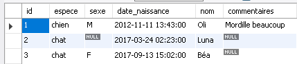
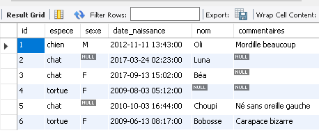

# Module 01 - Introduction aux bases de données 2 / 2

---

## Environnement

- MySQL Server
- MySQL Workbench

## Directive

- Sauvegardez vos réponses texte et vos instructions SQL dans un fichier au nom ```Module_02\Module02_DDL_CreationTables_Exercices_1_2.sql```
- Le corrigé est caché dans les exercices ou présent dans le répertoire de l'exercice

---

## Exercice 1 - Analyser du code SQL

### Exercice 1.1 - Syntaxe des noms

Les noms d'objets SQL suivants sont-ils corrects ?

| Nom        | Oui/Non | Raison si non|
|------------|---------|--------------|
| DEPART     | | |
| ARRIVÉE    | | |
| DATE       | | |
| \_WIDE     | | |
| «CREATE»   | | |
| \#CLIENT   | | |
| IBM\_DB2   | | |
| 5e\_avenue | | |
| NOM        | | |

<details>
    <summary>Solution</summary>

| Nom        | Oui/Non | Raison si non|
|------------|---------|--------------|
| DEPART     | Oui     | |
| ARRIVÉE    | Non     | Le caractère accentué est interdit |
| DATE       | Non     | DATE est un mot réservé du SQL. Si on veut l’utiliser, il faut l’écrire "DATE" |
| \_WIDE     | Non     | Un nom d’objet SQL doit commencer par une lettre |
| "CREATE"   | Oui     | Il est placé entre guillemets |
| \#CLIENT   | Non     | Le caractère \# n’est pas autorisé dans un nom SQL |
| IBM\_DB2   | Oui     | |
| 5e\_avenue | Non     | Un nom d’objet SQL ne peut commencer par un chiffre|
| NOM        | Oui     | |

</details>

### Exercice 1.2 - Types de données

Choisissez le type de données le mieux approprié pour les cas suivants :

| Type de données           | Raison                          |
|---------------------------|---------------------------------|
| un nom de mois de l’année |                                 |
| un numéro de semaine      |                                 |
| un minutage               |                                 |
| un numéro de téléphone    |                                 |
| une numéro de facture     |                                 |

<details>
    <summary>Solution</summary>

| Type de données           | Raison                                                                   |
|---------------------------|--------------------------------------------------------------------------|
| un nom de mois de l’année | VARCHAR(9)                                                               |
| un numéro de semaine      | TINYINT, paraît suffisant car la numérotation des semaines va de 1 à 53  |
| un minutage               | FLOAT, permet de définir un minutage décimal                             |
| un numéro de téléphone    | INTEGER OU VARCHAR. INTEGER moins gourmet que VARCHAR mais ne permet que les nombres |
| un numéro de facture      | Souvent alphanumérique donc VARCHAR                                      |

</details>

## Exercice 2 - Table maintenance

Dans cet exercice, la table ```maintenance``` représente des activités de maintenances faites par des techniciens sur des outils dans une imprimerie.

L'exercice est découpé en trois partie : la création de la table à partir d'un exemple de données, un peu de théorie sur l'instruction ```INSERT``` et l'insertion concrète des données dans la BD.

### Exercice 2.1 - Création de la table

Vous pouvez faire cette partie dans MySQL Worbench :

- Ouvrez MySQl Workbench et connectez-vous à votre serveur de bases de données local
- Créez un nouveau script SQL
- Sauvegardez-le dans votre répertoire dédié au cours de bases de données avec le nom ```Module_02\Module02_DDL_CreationTables_Exercices_1_2.sql```
- À partir des données présentées dans le tableau suivant, proposez une définition (un script SQL) pour créer la table ```Maintenance```. Débutez sur papier en choisissant les types de données pour représenter les colonnes présentées dans le tableau suivant (***Attention, l'ordre des colonnes ne doit pas nécessairement être respecté.***) :

| Jour | Machine  | Numéro | Vitesse | Température | Heure | Evénement              |
|------|----------|--------|---------|-------------|-------|------------------------|
| Ven  | Massicot | 147    |         |             | 21:18 | Défaut de lame         |
| Sam  | Relieuse | 63     | 16      |             | 16:15 | Arrêt pour maintenance |
| Jeu  | Presse   | 87     | 6       | 62          | 11:40 | Bavure d'encre         |
| Sam  | Relieuse | 79     | 16      |             | 17:11 | Reprise                |
| Mar  | Presse   | 89     | 6       | 55          | 08:28 | Recadrage              |
| Mar  | Presse   | 132    | 8       | 68          | 09:58 | Changement encre       |
| Mer  | Massicot | 111    |         |             | 10:17 | Graissage coulisseau   |

- Écrivez les instructions SQL nécessaires à la création de cette table avec préalablement une suppression de la table si elle existe
- Exécutez votre script

### Un peu de théorie avant d'allez plus loin

Pour les besoins théoriques, nous utiliserons la table ```Animal```. (Cette section est tirée de Chantal Gribaumont, Administrez vos bases de données avec MySQL, Open Classrooms, 2e édition avec quelques modifications pour répondre à notre besoin) :

```sql
DROP DATABASE IF EXISTS elevage;
CREATE DATABASE elevage CHARACTER SET 'utf8'; 

USE elevage;

CREATE TABLE Animal (
	id 				SMALLINT UNSIGNED NOT NULL AUTO_INCREMENT,
	espece 			VARCHAR(40) NOT NULL,
	sexe 			CHAR(1),
	date_naissance 	DATETIME NOT NULL,
	nom 			VARCHAR(30),
	commentaires 	TEXT,
	PRIMARY KEY (id)
) ENGINE=INNODB;
```

#### Insertion simple des enregistrements

Deux possibilités s’offrent à nous lorsqu'on veut insérer une ligne dans une table :

- Donner une valeur pour chaque colonne de la ligne
- Soit ne donner les valeurs que de certaines colonnes, auquel cas il faut bien sûr préciser de quelles colonnes il s’agit.

##### Insertion sans préciser les colonnes (standard)

Voici donc la syntaxe à utiliser pour insérer une ligne dans une table Animal, sans renseigner les colonnes pour lesquelles on donne une valeur (implicitement, le SGBD considère que l’on donne une valeur pour chaque colonne de la table dans l'ordre de la définition).

```sql
INSERT INTO Animal VALUES (1, 'chien ', 'M', '2017-04-05 13:43:00', 'Oli', 'Mordille beaucoup ');
```

Autre exemple : cette fois-ci, on ne connaît pas le sexe et on n’a aucun commentaire à faire sur l'animal.

```sql
INSERT INTO Animal VALUES (2, 'chat', NULL , '2017-03-24 02:23:00', 'Luna ', NULL);
```

Autre situation : on donne NULL comme valeur d’id, ce qui en principe est impossible puisque id est défini comme NOT NULL et comme clé primaire. Cependant, l’autoincrémentation fait que MySQL va calculer quel id il faut donner à la ligne (ici : 3).

```sql
INSERT INTO Animal VALUES (NULL , 'chat', 'F', '2017-09-13 15:02:00', 'Béa', NULL);
```

Régardons le résulat :

```sql
SELECT * FROM Animal;
```



##### Insertion en précisant les colonnes

Dans la requête, nous allons donc écrire explicitement à quelle(s) colonne(s) nous donnons une valeur. Ceci va permettre deux choses :

- On ne doit plus donner les valeurs dans l’ordre de création des colonnes, mais dans l’ordre précisé par la requête
- On n’est plus obligé de donner une valeur à chaque colonne ; plus besoin de NULL lorsqu’on n’a pas de valeur à mettre.

Quelques exemples :

```sql
INSERT INTO Animal (espece , sexe , date_naissance) VALUES ('tortue ', 'F', '2009 -08 -03 05:12:00');
INSERT INTO Animal (nom , commentaires , date_naissance , espece) VALUES ('Choupi ', 'Né sans oreille gauche ', '2010 -10 -03 16:44:00', 'chat ');
INSERT INTO Animal (espece , date_naissance , commentaires , nom ,sexe) VALUES ('tortue ', '2009 -06 -13 08:17:00', 'Carapace bizarre ', 'Bobosse ', 'F');
```

Ce qui vous donne trois animaux supplémentaires (donc six en tout, il faut suivre ;-))

```sql
SELECT * FROM Animal;
```



#### Insertion multiple

Si vous avez plusieurs lignes à introduire, il est possible de le faire en une seule requête de la manière suivante :

```sql
INSERT INTO Animal (espece , sexe , date_naissance , nom)
VALUES ('chien ',  'F',  '2008 -12 -06 05:18:00', 'Caroline '),
       ('chat ',   'M',  '2008 -09 -11 15:38:00', 'Bagherra '),
       ('tortue ', NULL, '2010 -08 -23 05:18:00', NULL);
```

Bien entendu, vous êtes alors obligé de préciser les mêmes colonnes pour chaque entrée, quitte à mettre NULL pour certaines. Mais avouez que ça fait quand même moins à écrire !

### Exercice 2.2 - Insertion des enregistrements - À vous de jouer !

- Créez les instructions nécessaires à l'insertion des enregistrements en précisant le nom des colonnes pour les enregistrements suivants :

| Jour | Machine  | Numéro | Vitesse | Température | Heure | Evénement              |
|------|----------|--------|---------|-------------|-------|------------------------|
| Ven  | Massicot | 147    |         |             | 21:18 | Défaut de lame         |
| Sam  | Relieuse | 63     | 16      |             | 16:15 | Arrêt pour maintenance |
| Jeu  | Presse   | 87     | 6       | 62          | 11:40 | Bavure d'encre         |
| Sam  | Relieuse | 79     | 16      |             | 17:11 | Reprise                |
| Mar  | Presse   | 89     | 6       | 55          | 08:28 | Recadrage              |
| Mar  | Presse   | 132    | 8       | 68          | 09:58 | Changement encre       |
| Mer  | Massicot | 111    |         |             | 10:17 | Graissage coulisseau   |

Vous pouvez sauvegarder vos instructions SQL dans le fichier ```Module_02/Module02_DDL_CreationTables_Exercices_1_2.sql```.
