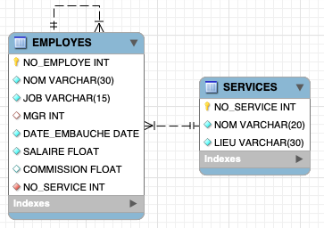
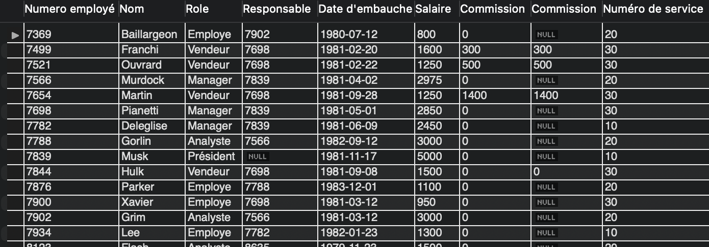
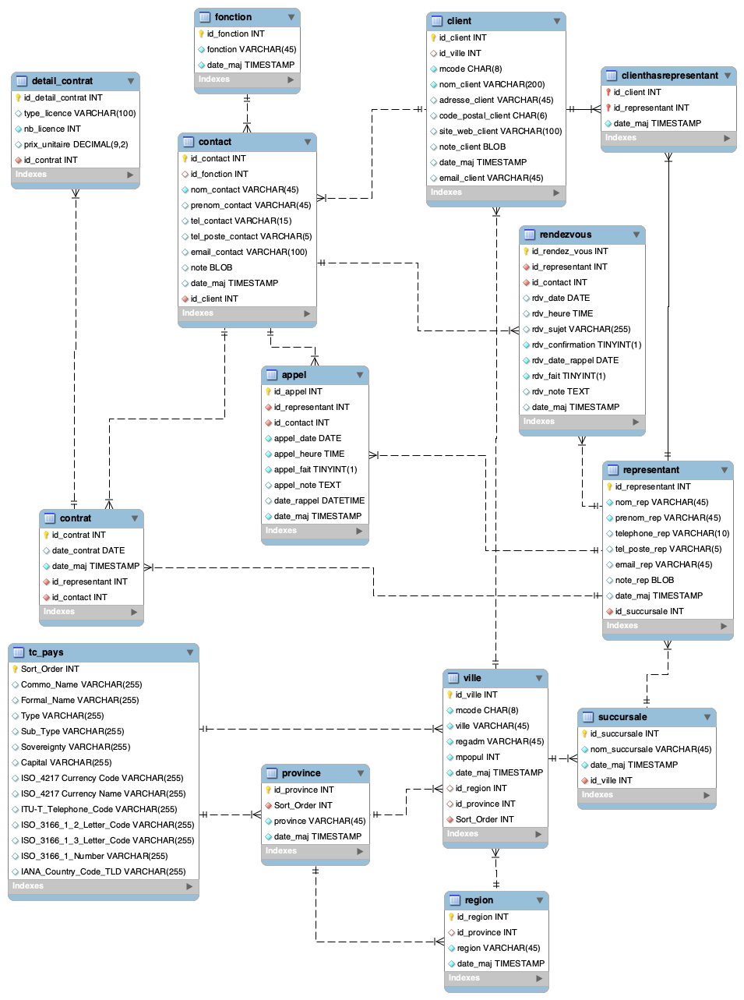

# Module 04 - DML - CRUD

---

## Environnement

- MySQL Server
- MySQL Workbench

## Directive

- Sauvegardez vos réponses texte et vos instructions SQL dans un fichier au nom ```Module_04\Module04_DML_Exercice_XX.sql``` où XX représente le numéro de l'exerice.
- Le corrigé est caché dans les exercices ou présent dans le répertoire de l'exercice

---

## Exercice 1 - Employés

Pour cet exercice, vous allez mettre votre code SQL dans le fichier ```Module_04\Module04_DML_Exercice_01.sql```.

Cet exercice traite d'une base de données d'employés. Les employés sont assignés à un service. Les employés ont un responsable qui est aussi un employé. Comme dans toute hiérarchie, au moins un des employés ne peut pas avoir de responsable car il est en faut de la pyramide.

### Exercice 1.1 - Création de la base de données

1. Analysez les requêtes proposées ci-après dans la section "Code SQL"

<details>
    <summary>Code SQL</summary>

```sql
DROP DATABASE IF EXISTS Module04_Exercice1;

CREATE DATABASE Module04_Exercice1;
USE Module04_Exercice1;

CREATE TABLE SERVICES
(
  NO_SERVICE  INTEGER PRIMARY KEY,
  NOM         VARCHAR(20) NOT NULL,
  LIEU        VARCHAR(30) NOT NULL
);

CREATE TABLE EMPLOYES
(
  NO_EMPLOYE    INTEGER PRIMARY KEY,
  NOM           VARCHAR(30) NOT NULL,
  JOB           VARCHAR(15) NOT NULL,
  MGR           INTEGER NULL,
  DATE_EMBAUCHE DATE NOT NULL,
  SALAIRE       FLOAT NOT NULL,
  COMMISSION    FLOAT NULL,
  NO_SERVICE    INTEGER NOT NULL,
  FOREIGN KEY (NO_SERVICE) REFERENCES SERVICES(NO_SERVICE),
  FOREIGN KEY (MGR) REFERENCES EMPLOYES(NO_EMPLOYE)
);
```

</details>

2. Si le code vous semble sans danger, exécutez le sur votre environnement
3. Afin de bien analyser cette base de données, générez le diagramme

<details>
    <summary>Schéma de la base de données si vous avez des problèmes à le générer</summary>



</details>

4. Créez les enregistrements correspondants aux données demandées :

- Données de la table ```SERVICES```

|NO_SERVICE|NOM|LIEU|
|---|---|---|
|10|Comptabilité|Toronto|
|20|Recherche|Québec|
|30|Ventes|Montréal|
|40|Opérations|Québec|

- Données de la table ```EMPLOYES```

|NO_EMPLOYE|NOM|JOB|MGR|DATE_EMBAUCHE|SALAIRE|COMMISSION|NO_SERVICE|
|:---:|---|---|:---:|:---:|---:|--:|:---:|
|7839|Musk|Président||1981-11-17|5000.00||10|
|7566|Murdock|Manager|7839|1981-04-02|2975.00||20|
|7902|Grim|Analyste|7566|1981-03-12|3000.00||20|
|7369|Baillargeon|Employe|7902|1980-07-12|800.00||20|
|7698|Pianetti|Manager|7839|1981-05-01|2850.00||30|
|7499|Franchi|Vendeur|7698|1981-02-20|1600.00|300.00|30|
|7521|Ouvrard|Vendeur|7698|1981-02-22|1250.00|500.00|30|
|7654|Martin|Vendeur|7698|1981-09-28|1250.00|1400.00|30|
|7782|Deleglise|Manager|7839|1981-06-09|2450.00||10|
|7788|Gorlin|Analyste|7566|1982-09-12|3000.00||20|
|7844|Hulk|Vendeur|7698|1981-09-08|1500.00|0.00|30|
|7876|Parker|Employe|7788|1983-12-01|1100.00||20|
|7900|Xavier|Employe|7698|1981-03-12|950.00||30|
|7934|Lee|Employe|7782|1982-01-23|1300.00||10|

</details>

1. Expliquez pourquoi on ne peut pas insérer les données dans n'importe quel ordre (exemple : pourquoi ne peut-on pas insérer 'Musk' en dernier ?)
2. Comment auriez-vous pu faire pour insérer les données dans l'ordre des ```NO_EMPLOYE``` ?

<details>
    <summary>Solution</summary>

En débutant par l'insertion des enregistrements sans spécifier le responsable puis en faisant une mise à jour avec l'instruction ```UPDATE```

</details>

7. Testez votre hypothèse en ajoutant l'employé 'Flash' puis 'Wells', 'Wells' étant le responsable de 'Flash' :

|NO_EMPLOYE|NOM|JOB|MGR|DATE_EMBAUCHE|SALAIRE|COMMISSION|NO_SERVICE|
|:---:|---|---|:---:|:---:|---:|--:|:---:|
|8123|Flash|Analyste|8635|1979-11-23|1500.00||20|
|8635|Wells|Manager|7839|1981-04-02|4500.00||20|

1. Créez une requête pour afficher les données sous la forme d'un rapport (Attention aux noms de colonnes) comme ci-dessous :



<details>
    <summary>Correction des insertions</summary>

```sql
DROP DATABASE IF EXISTS Module04_Exercice1;

CREATE DATABASE Module04_Exercice1;
USE Module04_Exercice1;

CREATE TABLE SERVICES
(
  NO_SERVICE  INTEGER PRIMARY KEY,
  NOM         VARCHAR(20) NOT NULL,
  LIEU        VARCHAR(30) NOT NULL
);

INSERT INTO SERVICES VALUES
   (10, 'Comptabilité', 'Toronto'),
   (20, 'Recherche', 'Québec'),
   (30, 'Ventes', 'Montréal'),
   (40, 'Opérations', 'Québec');

CREATE TABLE EMPLOYES
(
  NO_EMPLOYE    INTEGER PRIMARY KEY,
  NOM           VARCHAR(30) NOT NULL,
  JOB           VARCHAR(15) NOT NULL,
  MGR           INTEGER NULL,
  DATE_EMBAUCHE DATE NOT NULL,
  SALAIRE       FLOAT NOT NULL,
  COMMISSION    FLOAT NULL,
  NO_SERVICE    INTEGER NOT NULL,
  FOREIGN KEY (NO_SERVICE) REFERENCES SERVICES(NO_SERVICE),
  FOREIGN KEY (MGR) REFERENCES EMPLOYES(NO_EMPLOYE)
);

INSERT INTO EMPLOYES  VALUES
(7839, 'Musk', 'Président', NULL, '1981-11-17', 5000, NULL, 10),
(7566, 'Murdock', 'Manager', 7839, '1981-04-02', 2975, NULL, 20),
(7902, 'Grim', 'Analyste', 7566, '1981-03-12', 3000, NULL, 20),
(7369, 'Baillargeon', 'Employe', 7902, '1980-07-12', 800, NULL, 20),
(7698, 'Pianetti', 'Manager', 7839, '1981-05-01', 2850, NULL, 30),
(7499, 'Franchi', 'Vendeur', 7698, '1981-02-20', 1600, 300, 30),
(7521, 'Ouvrard', 'Vendeur', 7698, '1981-02-22', 1250, 500, 30),
(7654, 'Martin', 'Vendeur', 7698, '1981-09-28', 1250, 1400, 30),
(7782, 'Deleglise', 'Manager', 7839, '1981-06-09', 2450, NULL, 10),
(7788, 'Gorlin', 'Analyste', 7566, '1982-09-12', 3000, NULL, 20),
(7844, 'Hulk', 'Vendeur', 7698, '1981-09-08', 1500, 0, 30),
(7876, 'Parker', 'Employe', 7788, '1983-12-01', 1100, NULL, 20),
(7900, 'Xavier', 'Employe', 7698, '1981-03-12', 950, NULL, 30),
(7934, 'Lee', 'Employe', 7782, '1982-01-23', 1300, NULL, 10);

INSERT INTO EMPLOYES VALUES
(8123,'Flash','Analyste',NULL,'1979-11-23',1500.00,NULL,20),
(8635,'Wells','Manager',7839,'1981-04-02',4500.00,NULL,20);

UPDATE EMPLOYES
SET MGR = 8635
WHERE NO_EMPLOYE = 8123;

SELECT 
    NO_EMPLOYE AS 'Numero employé',
    NOM AS Nom,
    JOB AS Role,
    MGR AS 'Responsable',
    DATE_EMBAUCHE AS 'Date d''embauche',
    SALAIRE AS 'Salaire',
    IFNULL(COMMISSION, 'Aucune') AS Commission,
    NO_SERVICE AS 'Numéro de service'
FROM
    EMPLOYES;
```

</details>

### Exercice 1.2 - Sélections simples

1. Listez les noms et salaires des personnes travaillant dans le département 10
1. Listez les noms et salaires des personnes travaillant dans les départements 10 ou 20
1. Listez les noms, salaires et commissions des personnes qui ont reçues une commission. (Attention, validez que la commission n'est pas de 0)
1. Listez les noms, salaires et commissions des vendeurs qui ont une commission indéfinie (NULL) ou égale à 0
1. Listez les managers dont le salaire est supérieur à 2500
1. Listez les personnes dont le salaire est compris entre 1500 et 2000  (bornes incluses)
1. Vous vous êtes peut-être posé la question suivante : qu'est-ce qu'un manager ? Pensez-vous qu'il y a une ambiguïté entre la colonne ```JOB``` et et ```MGR```. Si oui, sans le mettre en oeuvre, proposez une piste de solution (La solution sera discutée plus loin dans la session)

<details>
    <summary>Solution</summary>

```sql
SELECT NOM, SALAIRE FROM EMPLOYES WHERE NO_SERVICE = 10;

SELECT NOM, SALAIRE FROM EMPLOYES WHERE NO_SERVICE IN (10, 20);

SELECT NOM, SALAIRE, COMMISSION FROM EMPLOYES WHERE COMMISSION IS NOT NULL AND COMMISSION != 0;

SELECT NOM, SALAIRE, COMMISSION FROM EMPLOYES WHERE JOB = 'Vendeur' AND (COMMISSION IS NULL OR COMMISSION = 0);

SELECT NOM, SALAIRE FROM EMPLOYES WHERE JOB = 'Manager' AND SALAIRE > 2500;

SELECT * FROM EMPLOYES WHERE SALAIRE >= 1500 AND SALAIRE <= 2000;
```

Un manager pourrait être défini comme un employé qui est au moins le manager d'un autre employé. Cependant, ici, le travail de manager est vu comme sa responsabilité principale et non comme une secondaire.

</details>

### Exercice 1.3 - Sélection avec opérateurs

Certains de ces opérateurs ont déjà été utilisés dans la section précédente. Nous allons nous focaliser sur les nouveautés dans les questions suivantes, à savoir les opérateurs BETWEEN, LIKE, CASE, WHEN, IN, IS, BINARY, COLLATE et REGEXP.

La signification des opérateurs ainsi que leur priorité est présentée ci-après, en partant de la priorité la plus basse vers la plus haute. Les opérateurs dans la même case ayant la même priorité.

| Opérateur | Signification                  | Exemples                                                          |
|------------------|-----------------------------------------|----------------------------------------------------------------------------|
| OR (\|\|)<br/>XOR | OU logique inclusif<br/>OU logique exclusif | ((nom :='MURDOCK')OR(no=1111) => MURDOCK                                   |
| AND (&&)         | ET logique                              | ((nom :='MURDOCK')AND(no=1111) => rien                                     |
| BETWEEN          | Intervalle de deux valeurs               | salaire BETWEEN 5000 AND 6000 => CHIRAC                                    |
| CASE<br/>WHEN ...<br/>THEN ...<br/>ELSE ...<br/>WHEN ...<br/>...<br/>END| Conditionnelle multiple<br/><br/>Si... alors ...sinon| SELECT CASE jour<br/>&nbsp;&nbsp;WHEN 1 THEN 'LUNDI'<br/>&nbsp;&nbsp;WHEN 2 THEN 'MARDI'<br/>END                                       |
| =, <=>,<br/>>=, >,<=,<br/><,<>,!=          | Comparaison                             | Présenté dans la section théorie                                           |
| IS               | Test booléen                            | 1 IS TRUE => 1 (Car 1 est Vrai)<br/>Valeurs testées : TRUES, FALSE ou UNKNOWN |
| LIKE             | Égalité incomplète avec caractère Joker | Nom LIKE 'MA\%' => MARTIN<br/>Nom LIKE 'M\_R\% => MARTIN + MURDOCK |
| REGEXP           | Expression régulière                    | REGEXP '([7-9]{4})' -> Les nombres à 4 chiffres. Voir figure \ref{figure3} |
| -, +     | Addition, soustraction< | colonne1 + colonne2 = Nouvelle valeur (Utilisez les alias (AS))  |
| *, /             | Multiplication, division | colonne1 / colonne2 = Nouvelle valeur (utiliser les alias)  |
| DIV<br/>\%, MOD              | Division entière<br/>Modulo               | 5 DIV 2 => 2<br/>5 MOD 2 => 1 (reste de 5 DIV 2)                                                              |
| NOT (!)          | Négation                                | NOT (x=y) <=> X!=Y                                                         |
| BINRARY          | Rend sensible à la casse et aux espaces | BINARY(Colonne1) = "abc"                                                   |

1. Sélectionnez la liste des employés gagnant entre 1500 et 2000 (mais sans utiliser <= et >=)
2. Listez les employés dont le nom comporte un ’L’
3. Listez les employés dont le nom comporte deux ’L’
4. Sélectionnez les employés ayant un ’L’ en troisième position dans leur nom
5. Listez les employés qui sont soit managers, soit vendeurs, soit employés
6. En utilisant l'opérateur ```CASE```, affichez les noms et le libellé ’Cadre’ pour les employés ’Manager’ ou ’President’ et ’Non cadre’ pour les autres.
7. Affichez les noms, les salaires, plus une colonne "Haut salaire" à 1, si l’expression salaire >= 3000 est vraie, et une colonne "Bas salaire" à 1, si l’expression salaire < 3000 est vraie
8. En utilisant l'opérateur ```BINARY```, affichez le salaire de la personne s’appelant 'DELEGLISE' (en respectant exactement la casse). Faîte de même pour 'Deleglise'
9. À l’aide de l’opérateur CASE, afficher les numéros de service des employés en toutes lettres
10. À l’aide de l’opérateur LIKE, trouver les employés dont le nom se termine par ’E’
11. À l’aide de l’opérateur REGEXP, trouver les employés dont le nom se termine par ’E’
12. Afficher le salaire annuel des vendeurs (sur 12 mois) incluant leur éventuelle commission. (Attention : la somme du salaire et de la commission peut être indéfinie. Si la commission est indéfinie, il faut lui affecter un 0 afin de ne pas rendre indéfini le résultat. On utilisera la fonction IFNULL pour ce faire)
13. Afficher les noms et salaires des vendeurs en simulant une augmentation de 15 %
14. Calculez le modulo 100 des salaires des vendeurs, sans utiliser l’opérateur % ni MOD (Voir DIV)
15. Affichez les employés par ordre alphabétique
16. Affichez les employéz par ordre décroisant de salaire
17. Affichez les deux vendeurs qui ont les plus grosses commissions
18. Affichez le vendeur qui a la deuxième plus grosse commission

<details>
    <summary>Solution</summary>

```sql
SELECT * FROM EMPLOYES WHERE SALAIRE BETWEEN 1500 AND 2000;

SELECT * FROM EMPLOYES WHERE NOM LIKE '%L%';

SELECT * FROM EMPLOYES WHERE NOM LIKE '%L%L%';

SELECT * FROM EMPLOYES WHERE NOM LIKE '__L%';

SELECT * FROM EMPLOYES WHERE JOB IN ('Manager', 'Vendeur', 'Employe');

SELECT NOM, CASE WHEN JOB = 'Manager' OR JOB = 'President' THEN 'Cadre' ELSE 'Non cadre' END AS Libelle FROM EMPLOYES;

SELECT NOM, SALAIRE, CASE WHEN SALAIRE >= 3000 THEN 1 ELSE NULL END AS 'Haut salaire', CASE WHEN SALAIRE < 3000 THEN 1 ELSE NULL END AS 'Bas salaire' FROM EMPLOYES;

SELECT SALAIRE FROM EMPLOYES WHERE BINARY(NOM) = 'DELEGLISE';

SELECT SALAIRE FROM EMPLOYES WHERE BINARY(NOM) = 'Deleglise';

SELECT NOM, CASE NO_SERVICE WHEN 10 THEN 'dix' WHEN 20 THEN 'vingt' WHEN 30 THEN 'trente' END AS NoService FROM EMPLOYES;

SELECT * FROM EMPLOYES WHERE NOM LIKE '%E';

SELECT * FROM EMPLOYES WHERE NOM REGEXP 'E$';

SELECT NOM, (SALAIRE + IFNULL(COMMISSION, 0)) * 12 AS 'Salaire annuel' FROM EMPLOYES;

SELECT NOM, SALAIRE * 1.15 AS 'Salaire projeté' FROM EMPLOYES WHERE JOB = 'Vendeur';

SELECT NOM, SALAIRE MOD 100 AS 'Salaire % 100 avec MOD', (SALAIRE - (SALAIRE DIV 100) * 100) AS 'Salaire % 100 sans MOD' FROM EMPLOYES;

SELECT * FROM EMPLOYES ORDER BY NOM;

SELECT * FROM EMPLOYES ORDER BY SALAIRE DESC;

SELECT * FROM EMPLOYES ORDER BY COMMISSION DESC LIMIT 2;

SELECT * FROM EMPLOYES ORDER BY COMMISSION DESC LIMIT 2,1;
```

</details>

### Exercice 1.4 - Un avant goût de la suite

Les requêtes qui suivent seront expliquées en cours dans le module sur les jointures. Cet exercice a pour but de vous introduire à la notion de jointures et de vous les faire expérimenter un peu avant la théorie.

1. Analysez et testez la requête suivante :

```sql
SELECT 
    e.NO_EMPLOYE AS 'Numero employé',
    e.NOM AS Nom,
    e.JOB AS Role,
    e.MGR AS 'Responsable',
    e.DATE_EMBAUCHE AS 'Date d''embauche',
    e.SALAIRE AS 'Salaire',
    IFNULL(e.COMMISSION, 'Aucune') AS Commission,
    s.NOM AS 'Service'
FROM
    EMPLOYES AS e
        INNER JOIN
    SERVICES AS s ON e.NO_SERVICE = s.NO_SERVICE;
```

2. Expliquez, en vos mots, ce que fait cette requête
3. Modifiez la requête afin d'ajouter la colonne ```Ville``` qui affiche le ```LIEU``` du service pour chaque enregistrement.
4. Observez le résultat de la requête suivante :

```sql
SELECT 
    e.NO_EMPLOYE AS 'Numero employé',
    e.NOM AS Nom,
    e.JOB AS Role,
    r.NOM AS 'Responsable',
    e.DATE_EMBAUCHE AS 'Date d''embauche',
    e.SALAIRE AS 'Salaire',
    IFNULL(e.COMMISSION, 'Aucune') AS Commission,
    s.NOM AS 'Service',
    s.LIEU AS 'Ville'
FROM
    EMPLOYES AS e
        INNER JOIN
    EMPLOYES AS r ON e.MGR = r.NO_EMPLOYE
        INNER JOIN 
    SERVICES AS s ON e.NO_SERVICE = s.NO_SERVICE;
```

Manque-t-il un enregistrement ? Si oui, observez les données et essayer de déduire pourquoi vous obtenez ce résultat.

5. Testez cette nouvelle requête et observez s'il y a une différence de résultat par rapport à la requête précédente.

```sql
SELECT 
    e.NO_EMPLOYE AS 'Numero employé',
    e.NOM AS Nom,
    e.JOB AS Role,
    r.NOM AS 'Responsable',
    e.DATE_EMBAUCHE AS 'Date d''embauche',
    e.SALAIRE AS 'Salaire',
    IFNULL(e.COMMISSION, 'Aucune') AS Commission,
    s.NOM AS 'Service',
    s.LIEU AS 'Ville'
FROM
    EMPLOYES AS e
        LEFT JOIN
    EMPLOYES AS r ON e.MGR = r.NO_EMPLOYE
        INNER JOIN
    SERVICES AS s ON e.NO_SERVICE = s.NO_SERVICE;
```

## Exercice 2 - Base de données ```Marketing```

### Exercice 2.1 - Importation de la base de données

1. Exécutez le script suivant [marketing.sql](sql/marketing.sql)
2. À l'intérieur de MySQL Workbench, dans la section ```Schemas``` :

- Sélectionnez avec le bouton droit de la souris votre base de données ```marketing```
- Sélectionnez ```Schema Inspector```
- Naviguez dans les différents onglets pour caractériser votre nouvelle base de données et répondez aux questions suivantes :
  - Donnez la taille de votre base de données
  - Donnez l'encodage des caractères de la base de données
  - Combien de tables contient la BD ?
  - Combien d'enregistrements contient la table ville ?
  - Qu'elle est la table comportant le plus d'enregistrement ?
  - Qu'elle est le poids (en octet) de cette table, et ce, en prenant le poids des données et celui des index ?
  - Y a-t-il des tables dont les index prennent plus de place (poids) que les données ?

<details>
    <summary>Solution</summary>

- Donnez la taille de votre base de données : 1,9 Mo
- Donnez l'encodage des caractères de la base de données : UTF-8 (Insensible à la casse)
- Combien de tables contient la BD ? (14)
- Combien d'enregistrements contient la table ville ? 1131
- Qu'elle est la table comportant le plus d'enregistrement ? Appel
- Qu'elle est le poids (en octet) de cette table, et ce, en prenant le poids des données et celui des index ? 416 + 224 = 640 Ko
- Y a-t-il des tables dont les index prennent plus de place (poids) que les données ? Oui : ville, contact, clienthasrepresentant, province, region, representant

</details>

### Exercice 2.2 - Sélections de pratique

Afin de mettre en oeuvre les quelques principes que nous avons vus, essayons de trouver les requêtes correspondantes aux questions suivantes :

1. Affichez la population de la ville de "Gaspé". Dans cette requête, n'affichez que les champs suivante : ```id_ville``` avec comme étiquette ```No de ville```, la ```Ville``` et la ```Population``` (```mpopul```).
2. Affichez les villes en ordre décroissant de population. Dans cette requête, utilisez les champs et étiquettes suivantes : Ville, Population, Région administrative.
3. Affichez la même requête que la question précédente, mais cette fois n'afficher que les 15 premières villes en ordre croissant de nom.
4. Affichez la même requête que la question précédente, mais cette fois n'afficher que les 15 dernières villes en ordre décroissant de nom.
5. Affichez la même requête que la question précédente, mais cette fois n'afficher que les 15 dernières villes en ordre croissant de nom.
6. Affichez les villes qui ont une population à 0. Dans cette requête, n'affichez que les champs suivante : ```id_ville``` avec comme étiquette ```No de ville```, la ```Ville```, et la ```Population``` (mpopul).
7. Affichez la même requête que la question précédente, mais cette fois remplacer l'ensemble des champs projetés par l'appel à la fonction suivante :  ```COUNT(id_ville) AS 'Nb de ville ayant 0 habitant'```.
8. Comparez le résultat des deux dernières requêtes. Que remarquez-vous ?
9. Affichez les contacts qui ont une adresse courriel dont le domaine est Canadien
10. Affichez les noms des contacts qui débutent par un "b"
11. Affichez les noms et prénoms des contacts qui contiennent deux "a" dans leur nom ou leur prénom

<details>
    <summary>Solution</summary>

```sql
SELECT 
    id_ville AS 'No de ville',
    ville AS 'Ville',
    mpopul AS 'Population'
FROM
    ville
WHERE
    ville = 'Gaspé';
    
SELECT 
    ville AS 'Ville',
    mpopul AS 'Population',
    regadm AS 'Région administrative '
FROM
    ville
ORDER BY mpopul DESC;

SELECT 
    ville AS 'Ville',
    mpopul AS 'Population',
    regadm AS 'Région administrative '
FROM
    ville
ORDER BY ville LIMIT 15 OFFSET 0; -- Ou LIMIT 0, 15

SELECT 
    ville AS 'Ville',
    mpopul AS 'Population',
    regadm AS 'Région administrative '
FROM
    ville
ORDER BY ville DESC LIMIT 15 OFFSET 0; -- Ou LIMIT 0, 15

SELECT 
    ville AS 'Ville',
    mpopul AS 'Population',
    regadm AS 'Région administrative '
FROM
    ville
ORDER BY ville LIMIT 15 OFFSET 1116; -- 1131 - 15

SELECT 
    id_ville AS 'No de ville',
    ville AS 'Ville',
    mpopul AS 'Population'
FROM
    ville
WHERE
    mpopul = 0;
    
SELECT 
    COUNT(id_ville) AS 'Nb de ville ayant 0 habitant'
FROM
    ville
WHERE
    mpopul = 0;
    
-- Nous avons simplement le nombre de villes sans habitant : la reqête a afficher le nombre d'enregistrements à la place d'afficher les enregistrements.

SELECT 
    *
FROM
    contact
WHERE
    email_contact LIKE '%ca';

SELECT 
    nom_contact
FROM
    contact
WHERE
    nom_contact LIKE 'b%';
    
SELECT 
    nom_contact
FROM
    contact
WHERE
    nom_contact LIKE '%a%a%';
```

</details>

### Exercice 2.3 - Explorons la base de données

1. Générez le schéma de la base de données. Arrangez les tables pour rendre le schéma lisible et explorez le
2. Quelle est la date de l'appel le plus ancien de la base de données (ne sortir qu'un enregistrement)
3. Quelle est la date de l'appel le plus récent de la base de données (ne sortir qu'un enregistrement)
4. Quelle est l'heure de l'appel le plus tôt dans la journée (ne sortir qu'un enregistrement)
5. Quelle est l'heure de l'appel le plus tard dans la journée (ne sortir qu'un enregistrement)
6. Sélectionnez les appels de la journée du 21 févier 2018 et les afficher par ordre de dates et heures croissantes
7. Sélectionnez les appels de la journée du 21 févier 2018 AM et les afficher par ordre d'heures croissantes
8. Sélectionnez le nom de la capitale, de la monnaie, l'indicatif d'appel et la terminaison des noms de domaines pour la Colombie
9. Sélectionnez le nom de la capitale, de la monnaie, l'indicatif d'appel et la terminaison des noms de domaines pour la France
10. Sélectionnez les noms de pays qui ont comme terminaison de noms de domaines ".aq"
11. Sélectionnez les noms de pays qui n'ont pas de terminaison de noms de domaines renseignés
12. Sélectionnez les rendez-vous effectués durant le mois de février 2018
13. À partir de la table rendez-vous, évaluez à partir de quand la base de données n'a pas été mise à jours. Validez si votre date semble cohérente avec l'ensemble de données

<details>
    <summary>Schéma marketing</summary>



</details>

<details>
    <summary>Solution</summary>

```sql
SELECT 
    *
FROM
    appel
ORDER BY appel_date
LIMIT 1;

SELECT 
    *
FROM
    appel
ORDER BY appel_date DESC
LIMIT 1;

SELECT 
    *
FROM
    appel
ORDER BY appel_heure
LIMIT 1;

SELECT 
    *
FROM
    appel
ORDER BY appel_heure DESC
LIMIT 1;

SELECT 
    *
FROM
    appel
WHERE
    appel_date = '2018-02-21'
ORDER BY appel_heure;
    
SELECT 
    *
FROM
    appel
WHERE
    appel_date = '2018-02-21'
        AND appel_heure <= '12:00'
ORDER BY appel_heure;

SELECT Commo_Name, Capital, `ISO_4217 Currency Name`, `ITU-T_Telephone_Code`, `IANA_Country_Code_TLD`
FROM tc_pays
WHERE Commo_Name='Colombia';

SELECT Commo_Name, Capital, `ISO_4217 Currency Name`, `ITU-T_Telephone_Code`, `IANA_Country_Code_TLD`
FROM tc_pays
WHERE Commo_Name='France';

SELECT *
FROM tc_pays
WHERE `IANA_Country_Code_TLD` = '.aq';

SELECT *
FROM tc_pays
WHERE `IANA_Country_Code_TLD` = '';

-- Non demandée pour préparation seulement
SELECT COUNT(*), IANA_Country_Code_TLD
FROM tc_pays
GROUP BY IANA_Country_Code_TLD;

SELECT * 
FROM rendezvous
WHERE rdv_date BETWEEN '2018-02-01' AND '2018-02-28'
ORDER BY rdv_date, rdv_heure;

SELECT * FROM rendezvous WHERE rdv_fait = 0 ORDER BY rdv_date; -- 12 février 2019
```

</details>

### Exercice 2.4 - Un avant goût de la suite

1. Essayons le code suivant :

```sql
SELECT COUNT(id_ville) FROM ville; -- Notez la quantité. 
SELECT COUNT(id_province) FROM province; -- Notez la quantité.
```

2. Que va-t-il arrivé si vous faite appel aux deux tables dans une même requête ? Testez-le :

```sql
SELECT ville, mpopul, province
FROM ville, province; 
```

3. Combien d'enregistrement vous renvoie cette requête ? Est-ce logique ? Voici le code :

```sql
SELECT COUNT(ville)
FROM ville, province;
```

4. Multiplier 1131 (nos villes) par 63 (nos provinces + des États Américains) votre résultat est de 71 253.

5. Alors qu'est-ce qu'a fait le moteur de base de données ? Il ne savait pas comment faire correspondent les villes et les provinces. Il a donc renvoyé les produits cartésiens. Donc pour chaque ville les 63 provinces.

6. Si j'ai 1 131 villes, qui ont des clés étrangères avec une seule province, combien d'enregistrement devrais-je avoir ?

**Il faut donc aider un peu le moteur de BD et lui dire qu'elle est la relation qui existe entre la table ville et la table province.**

7. À l'aide de la commande DESCRIBE, déterminez quels champs pourraient établir la relation entre les tables ville et province.

8. Maintenant, essayer ce code :

```sql
SELECT 
    ville, mpopul, province
FROM
    ville
        INNER JOIN
    province ON ville.id_province = province.id_province; 
```

9. Maintenant, calculons le nombre d'enregistrements pour cette requête :

```sql
SELECT 
    COUNT(*)
FROM
    ville
        INNER JOIN
    province ON ville.id_province = province.id_province; 
```

Vous venez d'établir une relation d'égalité entre la table province et la table ville. Cette clause s'appelle une jointure. Au prochain module nous allons détailler les différentes jointures possibles.
