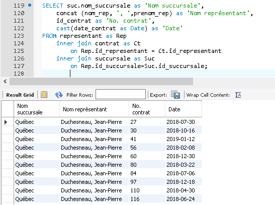

# Module 05 - DML - Jointures

---

## Environnement

- MySQL Server
- MySQL Workbench

## Directive

- Sauvegardez vos réponses texte et vos instructions SQL dans un fichier au nom ```Module_05\Module05_DML_Exercice_XX.sql``` où XX représente le numéro de l'exercice.
- Le corrigé est caché dans les exercices ou présent dans le répertoire de l'exercice

---

## Exercice 1 - Marketing

Pour cet exercice, nous allons utiliser la base de données Marketing :


- Connectez vous à votre serveur MySQL
- Exécutez le fichier SQL [Marketing.sql](sql/Marketing.sql)
- Essayez quelques requêtes de base pour bien connaître la bd :

```sql
USE marketing;

SHOW TABLES;
SELECT * FROM representant;
SELECT COUNT(*) FROM representant; 
/* Attention : la fonction COUNT() demande un paramètre soit une champ, en donnant le nom du champs ou tous les champs (*). */

SELECT * FROM succursale;
SELECT COUNT(*) FROM succursale;
```

- Qu'elle requête me permet de savoir dans quelle succursale sont les représentants ? Essayons comme ceci (avec des ajout dans le requête) :

```sql
SELECT 
    CONCAT(nom_rep, ', ', prenom_rep) AS Nom, -- Fonction de concaténation.
    id_succursale
FROM
    representant
ORDER BY
    CONCAT(nom_rep, ', ', prenom_rep); 
    -- On doit faire le tri sur le l'ensemble et non sur l'alias.
```

Cette requête nous donne la clef étrangère ```id_succursale```, mais pas le nom de la succursale.
Il est nécessaire de créer une jointure avec la table succursale pour avoir le nom de la succursale.

### Exercice 1 - Principe des jointures

Le principe des jointures est de joindre plusieurs tables. Pour ce faire, on utilise les informations communes des tables, soit les clefs primaires et les clefs étrangères.

En fait, lorsqu'on fait une jointure, on crée une table virtuelle et temporaire qui reprend les colonnes des tables liées.

```sql
SELECT *
FROM succursale
    INNER JOIN representant
    ON succursale.id_succursale = representant.id_succursale;
```

Voici ce que vous devriez voir :


Remarquez que dans le résultat, les quatre champs de la table ```succursale``` sont "ajoutés" à tous les champs de la table ```représentant```. Vous retrouvez deux champs ```id_succursale```. Pourquoi ?

Le premier est le champ provenant de la table ```succursale``` et le second celui de la table ```representant``` (la clef étrangère).

### Exercice 1 - Jointure interne

La clause ```INNER JOIN``` permet donc de faire une ***jointure interne*** sur deux tables.

Lorsqu’on fait une jointure interne, cela veut dire qu’on exige qu’il y ait des données de part et d’autre de la jointure; donc, si l’on fait une jointure sur la
colonne a de la table A et la colonne b de la table B :


#### Notion d’alias

Les alias sont des noms de remplacement, que l’on donne de manière temporaire (le temps d’une requête en fait) à une colonne, une table ou une donnée. Les alias sont
introduits par le mot-clef ```AS```.

Essayons à nouveau notre requête avec des alias dans les jointures :

```sql
SELECT *
FROM succursale AS suc
    INNER JOIN representant AS rep
    ON suc.id_succursale = rep.id_succursale;
```

Il s'agit exactement de la même requête avec une simplification des noms de tables. Comme précisé plus haut, les alias peuvent aussi se placer sur les noms de champs et les données.

On doit éviter d'utiliser les requêtes qui renvoient l'ensemble des champs. Il vaut mieux préciser ceux dont nous avons besoin. Par exemple :

```sql
SELECT 
    Suc.id_succursale, 
    nom_succursale, 
    CONCAT(nom_rep, ', ',prenom_rep) AS NomRep
FROM 
    succursale AS suc
    INNER JOIN representant AS rep
        ON suc.id_succursale = rep.id_succursale
ORDER BY 
    CONCAT(nom_rep, ', ',prenom_rep);      
/* Remarquez qu'on doit préciser si on veut le id_succursale de la table succursale ou celui de la table représentant. Sinon nous aurons l'erreur suivante : Nom de colonne 'id_succursale' ambigu.

On ajoute une clause ORDER BY pour avoir la sortie en ordre de représentant.*/
```

Résultat :


- Trouvez le code pour afficher la même requête en ordre croissant de succursale et en ordre décroissant de nom de représentant en deuxième clef.

<details>
	<summary>Solution</summary>

```sql
SELECT
    suc.id_succursale,
    nom_succursale,
    CONCAT(nom_rep, ', ',prenom_rep) AS NomRep
FROM
    succursale AS suc
    INNER JOIN representant AS rep
        ON suc.id_succursale = rep.id_succursale
ORDER BY
    nom_succursale ASC, CONCAT(nom_rep, ', ',prenom_rep) DESC;
```

</details>

### Exercice 1 - Jointure externe

Essayons maintenant de répondre à la question suivante :

Quelles sont les succursales qui n'ont pas de représentant ?

Pour bien comprendre, regardons ce dessin :


Donc ce que nous voulons, c'est la jointure gauche, sans les ```id_representant```, le dessins du bas :

```sql
SELECT 
    nom_succursale
FROM succursale AS suc
    LEFT JOIN representant AS rep
           ON suc.id_succursale = rep.id_succursale
WHERE
    id_representant is null;
```

Vous ne devriez avoir un seul enregistrement, "Sept-Iles", car toutes les autres succursales ont un représentant.

Ajoutons un représentant à la succursale de "Sept-Iles" pour vérifier le bon fonctionnement de notre jointure :

```sql
INSERT INTO representant 
    (nom_rep,prenom_rep,id_succursale)
    VALUES 
    ('Terry', 'Waspistan', 8);
```

Nous insérons seulement les champs obligatoire (```NOT NULL```).

Nous laissons les valeurs par défauts agir dans les cas suivants :

- ```id_representant``` : il est auto incrémenté
- ```date_maj``` : valeur par défaut ```CURRENT_TIMESTAMP```

Pour vous convaincre du bon fonctionnement de ces valeurs, essayez un ```SELECT``` après l'insertion.

```sql
SELECT * FROM representant ;
-- Remarquer l'id_représentant et la date_maj.
```

Maintenant, toujours pour vérifier le bon fonctionnement de notre requête de départ (LEFT JOIN) insérons de nouvelles succursales en exécutant cette requête : 

```sql
INSERT INTO succursale (nom_succursale,id_ville) 
VALUE 
('Pont-Rouge', (SELECT id_ville FROM ville WHERE ville LIKE 'Pont-Rouge')),
('Lévis',(SELECT id_ville FROM ville WHERE ville LIKE 'Lévis'));
```

***Attention :*** ici nous avons utilisé des requêtes ```SELECT``` pour trouver les deux ```id_ville``` correspondants à nos succursales. Cette façon de faire est très courante dans les requêtes d'insertion.

```sql
SELECT 
    suc.id_succursale,
    nom_succursale
FROM succursale AS suc
    LEFT JOIN representant AS rep
        ON suc.id_succursale = rep.id_succursale
WHERE
    id_representant IS NULL;
```

Voici maintenant ce que vous devriez avoir :


Pour avoir une jointure externe vers la droite, il faudrait permettre qu'un représentant puisse exister sans être dans une succursale.

Est-ce le cas ?

```sql
SELECT 
    concat (nom_rep, ', ',prenom_rep) AS NomRep
FROM succursale AS suc
    RIGHT JOIN representant AS rep
        ON suc.id_succursale = rep.id_succursale
WHERE rep.id_succursale IS NULL;
```

Nous allons insérer un représentant sans succursale.

Mais si nous visualisons le schéma de la base de données marketing, nous allons remarqué que notre clef étrangère ```id_susscursale``` est ```NOT NULL```, donc obligatoire.

Nous allons la modifier pour le besoins de la présentation avec le code suivante :

```sql
ALTER TABLE representant MODIFY COLUMN id_succursale INT NULL;
```

Il est maintenant permis d'entrer un représentant sans lui attribuer une succursale.

Allons-y avec ce code :

```sql
INSERT INTO representant
(nom_rep, prenom_rep, telephone_rep, tel_poste_rep,email_rep, note_rep, date_maj, id_succursale)
VALUES('Bouchard', 'Olivier', NULL, NULL, 'obouchard@gmail.com', NULL, NULL, NULL);
```

Vérifions à nouveau notre requête nous permettant de savoir si un représentant existe sans succursale  :

```sql
SELECT 
    id_representant,
    concat (nom_rep, ', ',prenom_rep) AS NomRep
FROM succursale AS suc
    RIGHT JOIN representant AS rep
        ON suc.id_succursale = rep.id_succursale
WHERE rep.id_succursale IS NULL;
```

Cette fois nous avons cette réponse :


### Exercice 1 - Jointures internes avec plus de deux tables

Il est possible de compliquer davantage en ajoutant une troisième table à la requête.

Nous voulons maintenant savoir ceux qui ont des contrats signés :

```sql
SELECT 
    suc.nom_succursale AS 'Nom succursale',
    concat (nom_rep, ', ',prenom_rep) AS 'Nom représentant', 
    id_contrat AS 'No. contrat',  
    CAST(date_contrat AS DATE) AS 'Date' -- fonction cast, vous connaissez !
FROM representant AS Rep
    INNER JOIN contrat AS Ct
        ON Rep.id_representant = Ct.id_representant
    INNER JOIN succursale AS Suc
        ON Rep.id_succursale=Suc.id_succursale;

```

Cette fois nous avons cette réponse :



Avec 400 enregistrements retournés (400 row(s)returned)

### Exercice 1 - Découverte préparatoire - GROUP BY

Si on veut donner la somme des contrats par succursale, on va donc devoir ajouter deux nouvelles tables, la table détaillée des contrats (outil\_has\_contrat) et outil.

La requête suivante fait appel aux 5 (cinq) tables ainsi qu'à la clause ```GROUP BY```.

La clause ```GROUP BY``` est utilisée en SQL pour grouper plusieurs résultats et utiliser une fonction de calcul sur un groupe de résultat. Ici à la somme par succursale.

```sql
SELECT  
    suc.nom_succursale AS 'Nom succursale',
    SUM(det.nbConnexion * ot.prixConnexion) AS 'Montant des contrats'
    /* La somme des contrat par succursale. On doit pour ce faire allez calculé chaque connexion.*/
FROM 
    outil AS ot
    INNER JOIN outil_has_contrat AS det
        ON ot.id_outil = det.id_outil
    INNER JOIN contrat ct
        ON det.id_contrat = ct.id_contrat
    INNER JOIN     representant AS rep
        ON rep.id_representant = ct.id_representant
    INNER JOIN       succursale AS suc
        ON rep.id_succursale = suc.id_succursale
GROUP BY suc.nom_succursale WITH ROLLUP; -- Groupé par succursale avec rollup (cumul)
```

Voici le résultat :


***Utilisation d’autres fonctions de statistiques***

Il existe plusieurs fonctions qui peuvent être utilisées pour manipuler plusieurs enregistrements, il s’agit des fonctions d’agrégations statistiques, les principales sont les suivantes :

- ***AVG()*** pour calculer la moyenne d’un set de valeur. Elle permet de connaître le prix du panier moyen pour chaque client.
- ***COUNT()*** pour compter le nombre de lignes concernées. Elle permet de savoir combien d’achats ont été effectués par chaque client.
- ***MAX()*** pour récupérer la plus haute valeur. Elle est pratique pour savoir l’achat le plus cher.
- ***MIN()*** pour récupérer la plus petite valeur. Elle est utile par exemple pour connaître la date du premier achat d’un client.
- ***SUM()*** pour calculer la somme de plusieurs lignes. Elle permet par exemple de connaître le total de tous les achats d’un client.

Ces petites fonctions se révèlent rapidement indispensables pour travailler sur des données.

### Exercice 1 - Découverte préparatoire - HAVING

La condition ```HAVING``` en SQL est presque similaire à ```WHERE``` à la seule différence que ```HAVING``` permet de filtrer en utilisant des fonctions telles que ```SUM()```, ```COUNT()```, ```AVG()```, ```MIN()``` ou ```MAX()```.

Exemple d'utilisation :

```sql
SELECT  
    suc.nom_succursale AS 'Nom succursale',
    SUM(det.nbConnexion * ot.prixConnexion) AS 'Montant des contrats'
FROM outil AS ot
    INNER JOIN outil_has_contrat AS det
        ON ot.id_outil = det.id_outil
    INNER JOIN contrat ct
        ON det.id_contrat = ct.id_contrat
    INNER JOIN    representant AS Rep
        ON Rep.id_representant = ct.id_representant
    INNER JOIN succursale AS suc
        ON Rep.id_succursale = suc.id_succursale
GROUP BY suc.nom_succursale 
HAVING SUM(det.nbConnexion * ot.prixConnexion) > 20000;
```

Voici le résultat :


### Exercice 1 - À vous !

Afficher la liste des clients dans les trois (3) formats suivants en incluant les champs ```nom_client```, ```adresse_client```, ```ville```, ```province```, ```pays```, ```code_postale``` :

1. Par nom de client
2. Par code postal
3. Par région administrative du Québec

<details>
	<summary>Soulution</summary>

***Question 1***

```sql
SELECT 
    nom_client, 
    adresse_client,
    ville,
    province,
    Commo_Name AS pays,
    code_postal_client
FROM client AS c
    INNER JOIN ville AS v
        ON c.id_ville = v.id_ville
    INNER JOIN province AS p
        ON v.id_province = p.id_province
    INNER JOIN tc_pays AS py
    	ON p.sort_order = py.Sort_order
ORDER BY nom_client;
```

***Question 2***

```sql
SELECT 
    nom_client, 
    adresse_client,
    ville,
    province,
    Commo_Name AS pays,
    code_postal_client
FROM client AS c
    INNER JOIN ville AS v
        ON c.id_ville = v.id_ville
    INNER JOIN province AS p
        ON v.id_province = p.id_province
    INNER JOIN tc_pays AS py
        ON p.sort_order = py.Sort_order
ORDER BY code_postal_client;
```

***Question 3***

```sql
SELECT 
    region,
    nom_client, 
    adresse_client,
    ville,
    province,
    Commo_Name AS pays,
    code_postal_client
FROM client AS c
    INNER JOIN ville AS v
        ON c.id_ville = v.id_ville
    INNER JOIN region AS r
        ON v.id_region = r.id_region
    INNER JOIN province AS p
        ON v.id_province = p.id_province
    INNER JOIN tc_pays AS py
        ON p.sort_order = py.Sort_order
ORDER BY region;
```

</details>

### Exercice 1 - À vous ! Requêtes complexes

1. Affichez les numéros de succursale, le nom de la succursale, et le nom du représentant concaténé (nom, prénom) dans l'ordre du nom succursale ascendant et comme deuxième ordre de tri  nom représentant croissant et ce, en respectant les libellés : ***No. succursale,  Succursale, Nom représentant.***
2. Affichez la somme des contrats pour chaque client en utilisant les informations suivantes dans l'ordre et en respectant les libellés (clause Alias): ***Nom du client, Montant total des contrats.***
   - A-t-on la preuve que les résultats renvoyés sont bons ? ***Non.***
   - Vérifions à partir d'une autre requête :
     - Donnez le montant de chacun des contrat pour le "CDE Collège". Additionnez ses montants et vérifiez avec la requête précédente pour voir si les résultat du ```GROUP BY``` sont bons.
3. Affichez la somme des contrats en ordre décroissant pour chaque représentant en utilisant les informations suivantes dans l'ordre et en respectant les libellés : ***Nom représentant, succursale, Total des contrats.***

<details>
	<summary>Solution</summary>

***Question 4.1***

```sql
SELECT 
    suc.id_succursale AS 'No. succursale', 
    nom_succursale AS Succursale, 
    CONCAT(nom_rep, ', ',prenom_rep) AS 'Nom représentant'
FROM 
    succursale AS suc
    INNER JOIN representant AS rep
    ON suc.id_succursale = rep.id_succursale
ORDER BY 
    suc.nom_succursale ASC, CONCAT(nom_rep, ', ',prenom_rep);
```

***Question 4.2***

```sql
SELECT  
    nom_client AS 'Nom du client',
    SUM(det.nbConnexion * ot.prixConnexion) AS 'Montant total des contrats'
FROM outil AS ot
    INNER JOIN outil_has_contrat AS det
        ON ot.id_outil = det.id_outil
    INNER JOIN contrat AS ct
        ON det.id_contrat = ct.id_contrat
    INNER JOIN contact AS con
        ON ct.id_contact = con.id_contact
    INNER JOIN client AS cli
        ON con.id_client = cli.id_client
GROUP BY nom_client;

```

***Vérification de la requête ***

```sql
SELECT  
    nom_client AS 'Nom du client',
    det.nbConnexion * ot.prixConnexion AS 'Montant total du contrats'
FROM outil AS ot
    INNER JOIN outil_has_contrat AS det
        ON ot.id_outil = det.id_outil
    INNER JOIN contrat AS ct
        ON det.id_contrat = Ct.id_contrat
    INNER JOIN contact AS con
        ON ct.id_contact = con.id_contact
    INNER JOIN client AS cli
        ON con.id_client = cli.id_client
WHERE nom_client LIKE "CDE Collège";
```

***Question 4.3***

```sql
SELECT  
    concat(nom_rep,', ',prenom_rep) AS 'Nom représentant',    
    nom_succursale AS succursale,
    SUM(det.nbConnexion * ot.prixConnexion) AS 'Total des contrats'
FROM outil AS ot
    INNER JOIN outil_has_contrat AS det
        ON ot.id_outil = det.id_outil
    INNER JOIN contrat AS ct
        ON det.id_contrat = Ct.id_contrat
    INNER JOIN representant AS rep
        ON rep.id_representant = ct.id_representant
    INNER JOIN succursale AS suc
        ON rep.id_succursale = suc.id_succursale
GROUP BY nom_rep
ORDER BY SUM(det.nbConnexion * ot.prixConnexion) DESC;
```

</details>
