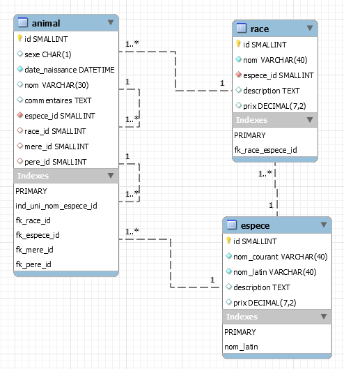

# Module 06 - DML - Fonctions

---

## Environnement

- MySQL Server
- MySQL Workbench

## Directive

- Sauvegardez vos réponses texte et vos instructions SQL dans un fichier au nom ```Module_06\Module06_DML_Exercice_XX.sql``` où XX représente le numéro de l'exercice.
- Le corrigé est caché dans les exercices ou présent dans le répertoire de l'exercice

---

## Exercice 1 - Base de données "Élevage"

Voici le schéma de la base de données élevage, sur lequel vous allez travailler.



L'ensemble des exercices sont tirés du livre de Chantal Gribaumont "Administrez vous bases de données avec MySQL 2ième édition." Open Classrooms (Chapitres 20 à 23).

Seule la mise en page est modifiée pour nos besoins.

### Exercice 1 -  Fonctions scalaires

#### Exercice 1 -  On commence par du facile

1. Affichez une phrase donnant le prix de l’espèce, pour chaque espèce. Par exemple, afficher "Un chat coûte 100 dollars.", ou une autre phrase du genre, et ce pour les cinq espèces enregistrées.
2. Affichez les chats dont la deuxième lettre du nom est un "a"

<details>
    <summary>Solution 1.</summary>

```sql
SELECT CONCAT('Un(e) ', nom_courant, ' coûte ', prix, ' dollars.') AS Solution
FROM espece;

-- OU

SELECT CONCAT_WS(' ','Un(e)', nom_courant, 'coûte', prix, 'dollars.') AS Solution
FROM espece;
```

</details>

<details>
    <summary>Solution 2.</summary>

```sql
SELECT animal.nom , espece.nom_courant
FROM animal
  INNER JOIN espece 
          ON animal.espece_id = espece.id
WHERE espece.nom_courant = 'Chat '
  AND nom LIKE '_a';

-- OU avec des fonctions

SELECT animal.nom , espece.nom_courant
FROM animal
  INNER JOIN espece 
          ON animal.espece_id = espece.id
WHERE espece.nom_courant = 'Chat '
  AND SUBSTRING(nom , 2, 1) = 'a';
```

</details>

#### Exercice 1 -  Puis on corse un peu

1. Affichez les noms des perroquets en remplaçant les « a » par « @ » et les « e » par « 3 » pour en faire des perroquets Kikoolol. **Attention**, il est tout à fait possible d’imbriquer plusieurs fonctions, ici c'est le cas avec la fonction ```REPLACE()```.
2. Affichez les chiens dont le nom a un nombre pair de lettres

<details>
    <summary>Solution 1.</summary>

Une petite explication s’impose avant de vous laisser continuer. Comme vous voyez, il est tout à fait possible d’imbriquer plusieurs fonctions. Le tout est de le faire correctement, et pour cela, il faut procéder par étape. Ici, vous voulez faire deux remplacements successifs dans une chaîne de caractères (en l’occurrence, le nom des perroquets).

Donc, vous effectuez un premier remplacement, en changeant les "a" par les "@" : ```REPLACE(nom, ’a’, ’@’)```.

Ensuite, sur la chaîne résultant de ce premier remplacement, vous effectuez le second : ```REPLACE(REPLACE(nom, ’a’, ’@’), ’e’, ’3’)```. Logique, non?

```sql
SELECT REPLACE(REPLACE(nom , 'a', '@'), 'e', '3') AS Solution
FROM animal
  INNER JOIN espece 
          ON animal.espece_id = espece.id
WHERE espece.nom_courant LIKE 'Perroquet%';
```

</details>

<details>
    <summary>Solution 2.</summary>

```sql
SELECT nom, nom_courant
FROM animal
  INNER JOIN espece 
          ON animal.espece_id = espece.id
WHERE espece.nom_courant = 'Chien'
  AND CHAR_LENGTH(nom) % 2 = 0;

-- OU
SELECT nom, nom_courant
FROM animal
  INNER JOIN espece 
          ON animal.espece_id = espece.id
WHERE espece.nom_courant = 'Chien'
  AND CHAR_LENGTH(nom) MOD 2 = 0;

-- OU
SELECT nom, nom_courant
FROM animal
  INNER JOIN espece 
          ON animal.espece_id = espece.id
WHERE espece.nom_courant = 'Chien'
  AND MOD(CHAR_LENGTH(nom), 2) = 0;
```

</details>

### Exercice 1 - Fonctions d'agrégation

1. Combien de races avons-nous dans la table ```race``` ?
2. De combien de chiens connaissons-nous le père ?
3. Quelle est la date de naissance de notre plus jeune femelle ?
4. En moyenne, quel est le prix d’un chien ou d’un chat de race, par espèce, et en général ?
5. Combien avons-nous de perroquets mâles et femelles, et quels sont leurs noms (en une seule requête bien sûr) ?
6. Quelles sont les races dont nous ne possédons aucun individu ?
7. Quelles sont les espèces (triées par ordre alphabétique du nom latin) dont nous possédons moins de cinq mâles ?
8. Combien de mâles et de femelles de chaque race avons-nous, avec un compte total intermédiaire pour les races (mâles et femelles confondues) et pour les espèces ? Affichez le nom de la race, et le nom courant de l’espèce.
9. Quel serait le coût, par espèce et au total, de l’adoption de "Parlotte", "Spoutnik", "Caribou", "Cartouche", "Cali", "Canaille", "Yoda", "Zambo" et "Lulla" ?

*Petit indice*, pour avoir le prix d’un animal selon que sa race soit définie ou non, vous pouvez utiliser une fonction que nous avons vu dans un module précédent.

<details>
    <summary>Solution 1.</summary>

```sql
SELECT COUNT (*)
FROM Race;
```

</details>

<details>
    <summary>Solution 2.</summary>

L’astuce ici était de ne pas oublier de donner la colonne ```pere_id``` en paramètre à ```COUNT()```, pour ne compter que les lignes où ```pere_id``` est non ```NULL```. Si vous avez fait directement ```WHERE espece_id = 1``` au lieu d’utiliser une jointure pour sélectionner les chiens, ce n’est pas bien grave.

```sql
SELECT COUNT(pere_id)
FROM animal
  INNER JOIN espece 
          ON espece.id = animal.espece_id
WHERE espece.nom_courant = 'Chien';
```

</details>

<details>
    <summary>Solution 3.</summary>

```sql
SELECT MAX(date_naissance)
FROM animal
WHERE sexe = 'F';
```

</details>

<details>
    <summary>Solution 4.</summary>

```sql
SELECT nom_courant AS espece , AVG(race.prix) AS prix_moyen
FROM race
  INNER JOIN espece 
          ON race.espece_id = espece.id
WHERE espece.nom_courant IN ('Chat ', 'Chien')
GROUP BY espece.nom_courant WITH ROLLUP;
```

Ne pas oublier ```WITH ROLLUP``` pour avoir le résultat général.

</details>

<details>
    <summary>Solution 5.</summary>

```sql
SELECT sexe , COUNT(*), GROUP_CONCAT(nom SEPARATOR ', ')
FROM animal
  INNER JOIN espece 
          ON animal.espece_id = espece.id
WHERE nom_courant = 'Perroquet amazone'
GROUP BY sexe;
```

Il suffisait de se souvenir de la méthode ```GROUP_CONCAT()``` pour pouvoir réaliser simplement cette requête. Peut-être avez-vous groupé sur l’espèce aussi (avec ```nom_courant``` ou autre). Ce n’était pas nécessaire puisqu’on avait restreint à une seule espèce avec la clause ```WHERE```. Cependant, cela n’influe pas sur le résultat, mais sur la rapidité de la requête.

</details>

<details>
    <summary>Solution 6.</summary>

```sql
SELECT race.nom , COUNT(animal.race_id) AS nombre
FROM race
  LEFT JOIN animal 
         ON animal.race_id = race.id
GROUP BY race.nom
HAVING nombre = 0;
```

Il fallait ici ne pas oublier de faire une jointure externe (```LEFT``` ou ```RIGHT```, selon votre requête), ainsi que de mettre la colonne ```animal.race_id``` (ou ```animal.id```, ou ```animal.espece_id``` mais c’est moins intuitif) en paramètre de la fonction ```COUNT()```.

</details>

<details>
    <summary>Solution 7.</summary>

```sql
SELECT espece.nom_latin , COUNT(espece_id) AS nombre
FROM espece
 LEFT JOIN animal ON animal.espece_id = espece.id
WHERE sexe = 'M' OR animal.id IS NULL
GROUP BY espece.nom_latin
HAVING nombre < 5;
```

À nouveau, une jointure externe et ```espece_id``` en argument de ```COUNT()```, mais il y avait ici une petite subtilité en plus. Puisqu’on demandait des informations sur les mâles uniquement, il fallait une condition ```WHERE sexe = ’M’```. Mais cette condition fait que les lignes de la jointure provenant de la table ```espece``` n’ayant aucune correspondance dans la table ```animal``` sont éliminées également (puisque forcément, toutes les colonnes de la table ```animal```, dont sexe, seront à ```NULL``` pour ces lignes). Par conséquent, il fallait ajouter une condition permettant de garder ces fameuses lignes (les espèces pour lesquelles on n’a aucun individu, donc aucun mâle). Il fallait donc ajouter ```OR animal.id IS NULL```, ou faire cette condition sur toute autre colonne d’```animal``` ayant la contrainte ```NOT NULL```, et qui donc ne sera ```NULL``` que lors d’une jointure externe, en cas de noncorrespondance avec l’autre table. Il n’y a plus alors qu’à ajouter la clause ```HAVING``` pour sélectionner les espèces ayant moins de cinq mâles.

</details>

<details>
    <summary>Solution 8.</summary>

```sql
SELECT animal.sexe , race.nom , espece.nom_courant , COUNT (*) AS
nombre
FROM animal
  INNER JOIN espece 
          ON animal.espece_id = espece.id
  INNER JOIN race 
          ON animal.race_id = race.id
WHERE animal.sexe IS NOT NULL
GROUP BY espece.nom_courant , race.nom , sexe 
WITH ROLLUP; 
```

Deux jointures sont nécessaires pour pouvoir afficher les noms des races et des espèces. Il suffit alors de ne pas oublier l’option ```WITH ROLLUP``` et de mettre les critères de regroupement dans le bon ordre pour avoir les super-agrégats voulus.

</details>

<details>
    <summary>Solution 9.</summary>

```sql
SELECT espece.nom_courant , SUM(COALESCE(race.prix, espece.prix)) AS somme
FROM animal
  INNER JOIN espece 
          ON espece.id = animal.espece_id
  LEFT JOIN race
         ON race.id = animal.race_id
WHERE animal.nom IN ('Parlotte ', 'Spoutnik ', 'Caribou ', 'Cartouche ', 'Cali ', 'Canaille ', 'Yoda ', 'Zambo ', 'Lulla ')
GROUP BY espece.nom_courant WITH ROLLUP;
```

C’est ici la fonction ```SUM()``` qu’il fallait utiliser, puisqu’on veut le prix total par groupe. Sans oublier le ```WITH ROLLUP``` pour avoir également le prix total tous groupes confondus. Quant au prix de chaque animal, c’est typiquement une situation où l’on peut utiliser ```COALESCE()``` !

</details>
